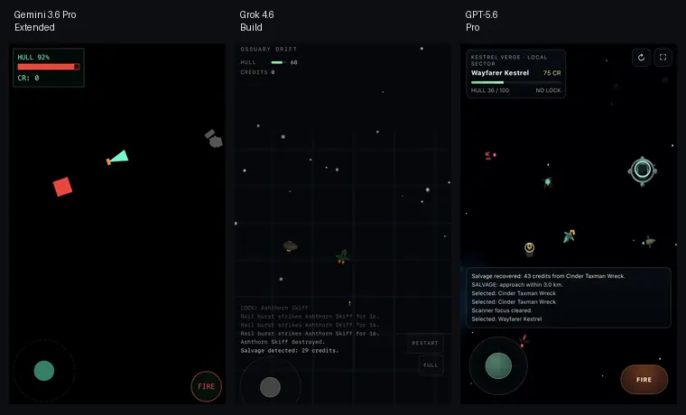

# Prompt Archaeology, Round 3: Reasoning, Harnesses, and Format Drift

*Discovery log, 2026-08-29*

Round 2 used fast chat models and produced three unacceptable one-shot builds. For Round 3 we kept the same hostile-space prompt but moved to stronger reasoning or build-oriented modes.

This round did better overall, but it also exposed a new variable: **the model is only part of the system**. Reasoning budget, output budget, execution harness, product mode, and hidden project templates can change the result as much as the model family.

The Grok Build and GPT-5.6 Pro source files were not retained for this entry, so those notes are based on the tested behavior and screenshots. The Gemini result required manual syntax repairs before it could be viewed; we record that as a generation failure rather than treating the repaired artifact as untouched output.

## Gemini 3.6 Pro extended reasoning: more thought, wrong representation

Gemini returned an HTML artifact, but the first usable version required manual syntax repair. The rendered result reduced the world to flat, incorrectly rotated shapes. It technically resembled the requested entities, yet lost the 3D composition, visual language, and polish expected from the prompt.

**What crossed:** mobile HUD, joystick, player health, credits, enemies, wreck-like contacts, and a fire control.

**What did not:** reliable syntax, spatial presentation, orientation, Three.js visual quality, and the requested modern 3D feel.

There are two plausible causes, but we cannot prove either without the exact generation environment:

1. the long prompt overloaded the generation and encouraged checklist completion over coherent composition;
2. Gemini's canvas or app scaffold may have carried React, Google API, or template assumptions that competed with the explicit single-file request.

**Lesson:** extended reasoning does not help when the implementation is anchored to the wrong representation or scaffold. A long acceptance list can still yield a scene that checks nouns while missing the intended game.

## Grok 4.6 Build: the harness helped, but the format contract lost

Grok Build did not return an HTML-all-in-one artifact. It created a repository with Vite setup, project files, and `AGENTS.md`. That is a direct failure of the HAIO output contract.

The playable result was nevertheless much healthier than the fast one-shot attempts. The harness could create files, run a development workflow, and repair integration problems. The sector, event feed, targeting, combat, and salvage behavior were mostly present.

The remaining problems were visual and experiential:

- the camera-following background made movement feel like standing still;
- the lighting and materials were too dark;
- the scene remained too zoomed out;
- the interface occupied more space than the core movement loop needed.

**Lesson:** a work harness can rescue implementation quality while simultaneously overriding the requested artifact shape. Build mode optimized for “make a project,” not “return one portable file.” Format compliance and runtime quality are separate axes.

## GPT-5.6 Pro: expensive, large, and clearly strongest

GPT-5.6 Pro took roughly an hour and returned a large single HTML file of about two thousand lines. It was the strongest result in this round and the closest to the intended sector.

The larger reasoning and output budget appears to have helped it integrate the requirements rather than merely enumerate them. The world was legible, the entities had visual identity, the station and salvage loop read clearly, and the result remained a real HAIO.

The remaining complaints mostly came from our design brief rather than catastrophic implementation failure:

- the view was still too distant;
- the large manual `FIRE` button competed with the joystick;
- selecting and collecting small salvage objects was awkward;
- the event feed and controls could be less dominant.

**Lesson:** deeper reasoning and enough output budget improved one-shot integration substantially, but they did so at a large time and artifact-size cost. Reasoning helped most when the model also respected the requested delivery format.

## The experiment now has five variables

Comparing model names alone is no longer enough. Each run should record:

1. **Model** — the underlying model family.
2. **Reasoning budget** — fast chat, extended reasoning, or maximum/pro reasoning.
3. **Output budget** — whether the response can physically finish the artifact.
4. **Harness access** — whether the model can run, inspect, and repair the result.
5. **Product scaffold** — chat, canvas, build workspace, React template, repository agent, or another hidden environment.

Round 3 suggests:

| Mode | Runtime quality | Format compliance | Typical failure |
|---|---:|---:|---|
| Extended reasoning without a harness | Low in this run | Partial | Coherent-looking but invalid or misrepresented artifact |
| Build agent with a harness | Moderate | Failed | Working project that ignores the requested portable format |
| Pro reasoning with large output budget | Best | Passed | Slow, large, and still dependent on prompt design |

The current strongest conclusion is not “reasoning models are better” or “chat models are worse.” It is:

> Reliable artifact generation depends on the whole execution mode. Reasoning can improve integration, but a harness validates reality, and a harness can also pull the result away from the requested format.

## Design correction: make movement the primary control

The `FIRE` button should disappear. It consumes prime mobile space and adds a manual step to a combat loop that should feel continuous.

The next combat contract should be:

- only ships that have already become aggressive are eligible for automatic targeting;
- when no combat target exists, acquire the nearest eligible hostile inside an acquisition radius;
- keep the target until it dies, exits a larger break radius, becomes non-hostile, or the player explicitly disengages;
- use hysteresis: the break radius must be larger than the acquisition radius;
- fire automatically whenever the target is valid, in range, and the weapon cooldown is ready;
- tapping the active target toggles disengagement;
- provide one small `DISENGAGE` or lock-cancel control in the target HUD, not a large bottom-right attack button;
- after manual disengagement, suppress immediate reacquisition of that same target for a short cooldown or until it leaves the acquisition radius.

Selection remains useful for inspection and interactions, but selection and combat lock should remain separate state.

## Camera correction: between arena close-up and tactical satellite view

The previous prompt overcorrected the original close camera.

The next view should use a fixed, slightly oblique tactical camera:

- keep the player near the visual center;
- retain a slight tilt so hull height, station forms, and lighting read as 3D;
- target a player screen height around 8–12%;
- show enough nearby space for several contacts without reducing ships to icons;
- keep camera yaw fixed;
- avoid zoom changes during targeting;
- use world-anchored near-field debris and landmarks for motion reference;
- use slower far-field parallax rather than attaching the full star field rigidly to the camera.

A repeating background may wrap around the player, but its phase must remain world-relative so movement still looks like movement.

## Salvage correction: burst, magnet, collect

Small pickups should not require pixel-perfect selection or direct overlap.

When something breaks:

1. spawn several visible pickup objects with a short outward impulse;
2. let them drift for a brief readable moment;
3. when the player enters a magnetic radius, accelerate them toward the ship along curved or spring-smoothed paths;
4. auto-collect them inside a small collection radius;
5. show a compact trail, scale pulse, or HUD credit burst;
6. remove them through the normal entity cleanup transaction.

Ordinary credits and materials should use this magnetic pickup loop. Large wrecks, stations, and story objects may still use contextual interaction.

## Next prompt changes

The next prompt should remain architecturally strict but become shorter and more hierarchical:

- mandatory artifact and renderer contract first;
- simulation/lifecycle invariants second;
- core play loop third;
- visual targets and screen-space calibration fourth;
- optional polish last.

The test should separately score:

- whether the artifact is actually one HTML file;
- whether it parses and reaches a first frame;
- whether the ship reads as 3D and faces correctly;
- whether the opening encounter is safe;
- whether auto-target and auto-fire feel fluid;
- whether magnetic pickup works without precision tapping;
- whether the camera communicates motion and useful scale.

Round 3 finally produced one genuinely promising one-shot HAIO. It also showed why model, reasoning mode, harness, and scaffold must be tracked as separate experimental conditions.
