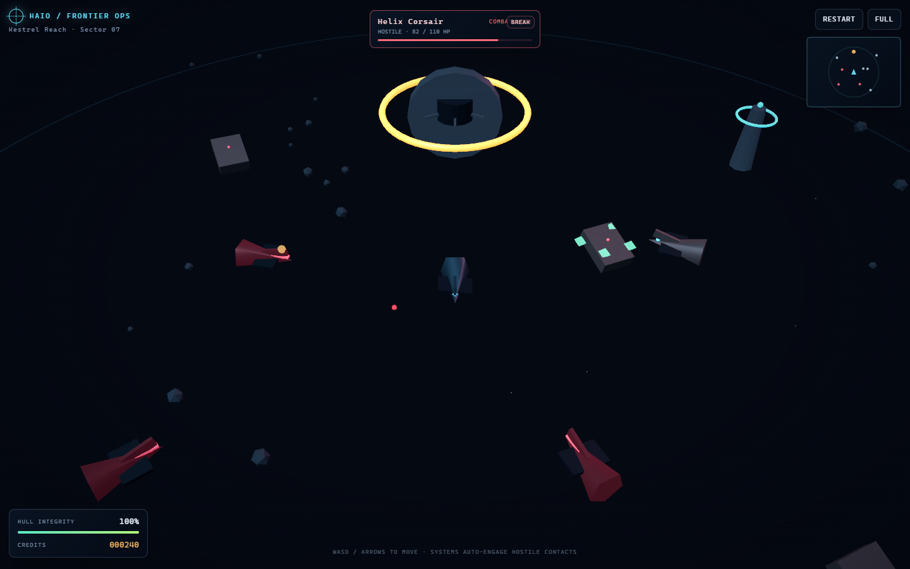
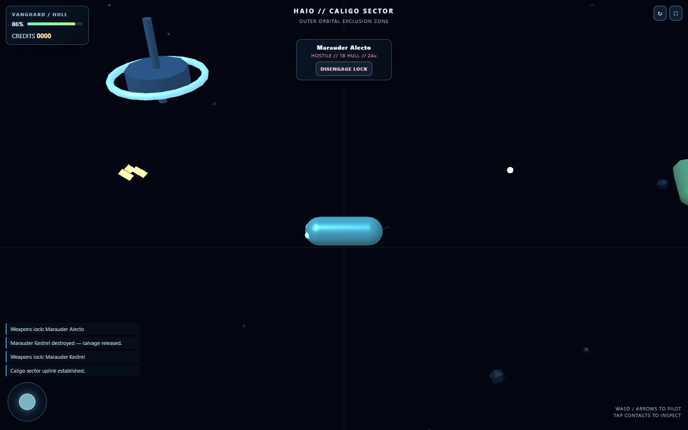
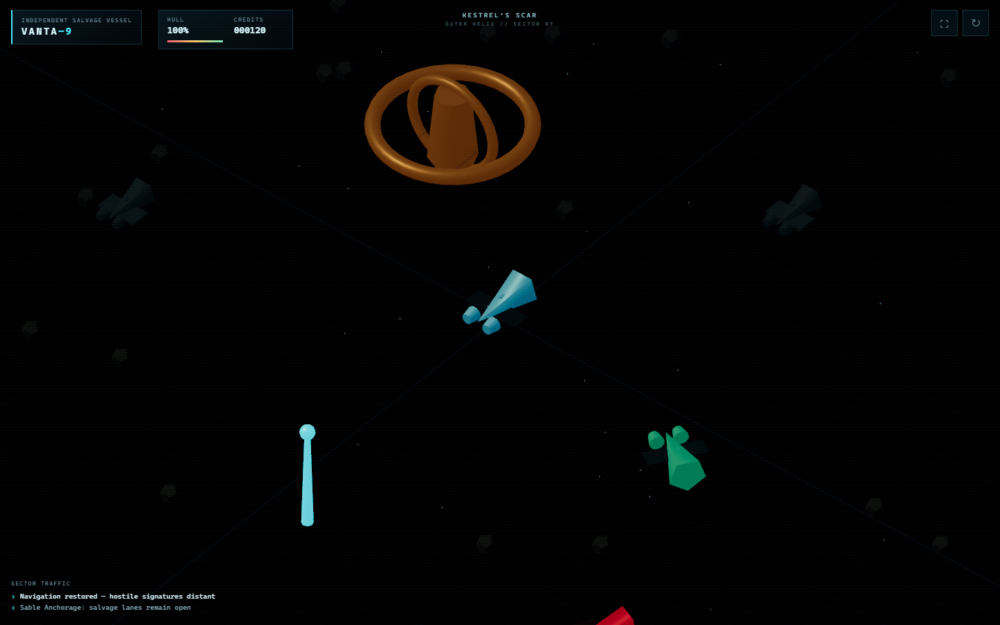

# Round 4: Pass-Down Workflow Experiment Report

## Status

Round 4 is complete as the no-mockup, uncontrolled-tools baseline. Luna, Terra, and Sol received the same hostile-space game brief in isolated projectless tasks, then the same clarification that “single HTML” described the runtime artifact rather than excluding decisions and evidence. They also received the same local-browser environment note.

Classification: skills and tools were allowed and materially used, but the available stack, routing choices, visual-analysis method, and evidence format were not frozen as experimental controls.

The operator reference and harness passed static verification plus 12 browser evidence groups on Chrome with `WebGPUBackend`. A neutral operator audit then loaded all three model artifacts for eight seconds at 1440 × 900 and checked canonical path existence, canvas presentation, console errors, and failed requests.

## Visual comparison

| Luna | Terra | Sol |
| --- | --- | --- |
|  |  |  |

The three results share the same basic composition because the pass-down required the same world topology: one player, four hostiles, a station, a neutral vessel, landmarks, automatic combat, magnetic salvage, compact HUD, and tactical camera. Similarity is therefore evidence that the core product contract crossed the model boundary. It is not, by itself, evidence that the models have the same capability.

The remaining differences are more useful: silhouette complexity, lighting, camera calibration, HUD density, visual hierarchy, amount of test evidence, repair behavior, and artifact discipline.

## Hard-gate result

| Model | Canonical artifact | Parse/bootstrap/frame | Operator console/network | Result |
| --- | --- | --- | --- | --- |
| Luna | Pass: `submission/index.html` | Pass | 0 / 0 | Passed hard gates |
| Terra | **Fail:** artifact remained at `outputs/submission/index.html` after one repair request | Pass from noncanonical path | 0 / 0 | Gated; do not rank as an ordinary pass |
| Sol | Pass: `submission/index.html` | Pass | 0 / 0 | Passed hard gates |

The Terra artifact is runnable, but the benchmark explicitly names `submission/index.html` as the final path. The operator did not move it behind the model’s back.

## Comparative result

Scores below are evidence-based rubric estimates, not pixel-perfect visual judgments. Terra’s raw score is shown for diagnosis but remains hard-gated.

| Area | Luna | Terra raw | Sol |
| --- | ---: | ---: | ---: |
| Artifact and format compliance | 10 | 3 | 10 |
| Bootstrap and runtime reliability | 15 | 14 | 15 |
| World identity and lifecycle correctness | 14 | 10 | 15 |
| Movement, facing, and camera | 13 | 11 | 14 |
| Threat, targeting, and combat | 14 | 13 | 15 |
| Magnetic salvage loop | 10 | 8 | 10 |
| Visual clarity and sector atmosphere | 8 | 4 | 8 |
| Mobile UI and interaction | 4 | 2 | 4 |
| Restart, diagnostics, and cleanup | 4 | 4 | 5 |
| **Raw total** | **92** | **69 gated** | **96** |

### Luna

- 329 lines / 37,738 bytes; 9 decision entries.
- Strong connected behavior, numeric-ID ownership, full screenshots, state-based browser waits, and a real repair of the Dock button’s pointer-layer bug.
- Multi-primitive ships and landmarks read clearly. Portrait composition is functional, though the station dominates the upper frame.
- Runtime evidence reports `WebGLBackend`, zero console/page errors, zero failed requests, and post-restart one-loop invariants.
- Elapsed task time: 965,670 ms, about 16:06.

### Terra

- 125 lines / 22,028 bytes; 9 decision entries.
- Fastest completion and a functioning combat, salvage, and restart loop, with zero errors in its own run and the operator bootstrap.
- It made the clearest spontaneous visual comment, “too close to a foreground landmark,” and repositioned the composition.
- Major ships remained simple capsule-like forms, contrary to the multi-primitive silhouette requirement; mobile evidence was incomplete; the exact artifact path remained wrong after a bounded repair request.
- Initial elapsed task time: 590,331 ms, about 9:50, plus a six-second unsuccessful path-repair follow-up.

### Sol

- 56 compact lines / 23,828 bytes; 10 decision entries.
- Strongest deterministic harness: 20 assertions covering bootstrap, movement/facing, combat, suppression, cleanup, salvage, interaction, blur, restart, ownership, console, and network behavior.
- Clear multi-part ships, coherent orthographic tactical composition, compact portrait HUD, and the smallest complete artifact.
- Runtime evidence reports `WebGLBackend`, zero console/page errors, zero failed requests, and 38 entity/render pairs with one loop after restart.
- Elapsed task time: 952,827 ms, about 15:53.

Line count is not a reliable proxy for intelligence or implementation depth because Luna and Sol used very different formatting and compression styles. Elapsed time, model size, and reasoning length may have contributed to the detail differences, but Round 4 does not isolate them from tool routing, implementation strategy, context selection, or repair effort.

## Skills and tools: allowed, used, but not controlled

Round 4 did allow normal Codex skills and tools. They were materially used, but the pass-down did not prescribe one identical skill stack or require a written visual critique. Skill and tool use is therefore observational metadata and an experimental confound.

| Model | Skills observed | Tool behavior observed | Visual self-critique quality |
| --- | --- | --- | --- |
| Luna | Playwright skill | Shell, browser automation/MCP, screenshots, state-based waits, console/network inspection | Called frames “coherent”; found concrete import-map and pointer-layer defects, but did not record a blunt aesthetic verdict |
| Terra | Project-scope-understanding, then Playwright | Playwright CLI snapshots/screenshots, console checks, repeated visual repositioning | Most explicit spontaneous judgment: foreground landmark was too close; still did not challenge capsule-like ship silhouettes |
| Sol | Sites building, Playwright/browser-testing | Custom Playwright harness, screenshots, source inspection, 20 assertions | Said it was doing a “final visual review,” but left no structured `GOOD`, `ODD`, or `BROKEN` critique |

None of the three model runs used image generation. Image generation was introduced after the round by the operator to create the first reference pair in `mockups/`.

GenEye was also not a frozen, project-local requirement. The repository contains no Round 4 skill directing every model to preflight the same GenEye profile, submit the same screenshot prompts, or retain the same semantic review schema. The reusable `Clone Behavior, Not Constants` method existed elsewhere in the repository, but it was not packaged as a visual skill or named in the pass-down. Expecting the agents to invent that orchestration independently was not a fair test.

### Availability is not activation

A tool merely being available does not mean a coding agent will infer that it should use it. Round 4 strongly requested browser proof, so all three agents reached for browser testing. It did not explicitly say:

1. generate or inspect a visual target before coding;
2. treat screenshots as a visual oracle rather than proof that a canvas exists;
3. compare the rendered frame against that oracle;
4. state candidly what looks broken, odd, or good;
5. make a bounded visual repair and recapture;
6. preserve the before/after evidence.

The agents optimized for the evidence we named: parse, bootstrap, interactions, state transitions, console, network, and invariants. Screenshot capture happened, but semantic screenshot review remained optional and vague.

### Screenshot capture is not visual judgment

Playwright can prove that a page loaded, a canvas has pixels, a button works, and a state changed. It cannot by itself establish that the station dominates the frame, every ship shares one capsule silhouette, the scene is too dark, the player lacks visual priority, or the composition matches the intended mood.

Those claims require a visual interpreter and an explicit review contract. The interpreter may be the coding model’s native image understanding, a fixed GenEye `general-game-qa` profile, or another common vision lane. For a controlled comparison, every model must use the same lane.

## What the models already brought

| Capability | Evidence in Round 4 | Missing support |
| --- | --- | --- |
| Connected implementation | All three produced runnable games; Luna and Sol passed canonical hard gates | Terra still lost the requested output path |
| Browser verification | All three used Playwright or browser tooling | The harness and exact skill route were not identical |
| Functional repair | Luna repaired a real pointer-layer defect; Terra changed composition; Sol built broad assertions | Visual repairs were not driven by a common oracle |
| Architectural compression | Sol delivered a small complete artifact; Terra moved fastest | Code size does not prove completeness or visual quality |
| Autonomous visual notice | Terra noticed one foreground-scale problem | No model produced a systematic visual critique |
| Evidence discipline | Luna and Sol retained substantial proof | Tool ledgers and visual-review schemas were not mandatory |

The models did not spontaneously build an image-generation, GenEye, browser, and visual-parity pipeline because the workflow did not describe one. That omission belongs to the pass-down, not solely to the models.

## The missing loop: visual oracle, critic, repair

The next workflow must close the loop explicitly:

```text
approved mockup
  -> implementable visual contract
  -> first-frame build
  -> deterministic screenshot
  -> blind self-critique
  -> standardized external visual critique
  -> one bounded repair
  -> recapture and compare
  -> continue to the next gameplay state
```

The critic should receive the reference image, actual screenshot, viewport, and visual contract. It should not receive the builder’s rationale before making its first judgment. This reduces commitment bias, where the same agent explains why its own result is acceptable instead of noticing that it looks wrong.

The required language should be concrete:

```text
Verdict: BROKEN | ODD | GOOD
Blunt read: This looks odd because the station consumes the upper third of the portrait frame.
Immediate impression: The station, not the player, is the visual subject.
Reference delta: Player is smaller; station is larger; hull lighting is darker.
Repair next: Reduce station screen occupancy and raise fill light on interactive ships.
Expected proof: Player remains readable at thumbnail scale and the station no longer dominates.
```

A `GOOD` verdict must still identify remaining deltas. Generic statements such as “looks coherent,” “looks polished,” or “matches the vibe” do not count as visual evidence.

## Darkness correction

The first operator-generated mockups are useful layout drafts, but they are too dark to freeze as the final Round 5 oracle. Space may remain nearly black. Interactive geometry should not.

The revised reference pair must preserve a dark navy background while raising object readability:

- midtone base colors on ships, stations, wrecks, and beacons;
- cool key light, neutral fill, and restrained warm rim light;
- emissive accents that define form rather than replacing illumination;
- no crushed-black hulls or heavy full-frame vignette;
- readable silhouettes at 25 percent thumbnail scale and in grayscale;
- player as the primary subject;
- station visible but non-dominant;
- clear hostile, neutral, salvage, and landmark color separation.

The existing images remain provenance for the Round 4 discovery path. Round 5 should generate and approve a brighter V2 pair rather than silently replacing them.

## Experimental limitations

- The three tasks did not begin from one frozen Git commit and one literally shared read-only harness.
- Skills were available but not prescribed; routing differed.
- The user-facing “single HTML” request initially conflicted with evidence-file wording and required one identical clarification.
- Browser environment guidance was added identically after Luna encountered a missing-browser lane.
- Terra received one model-specific artifact-path repair request and declined it.
- No fixed visual reference or formal screenshot-comparison protocol existed during the runs.
- Model size and reasoning length cannot be separated from elapsed time, tool choice, code compression, and implementation strategy.

## Next experiments

- [Round 5: Visual Oracle and Critic Loop](../round-5/PLAN.md) freezes the mockups, skill stack, visual interpreter, browser harness, critique vocabulary, and repair sequence.
- [Round 5 brighter mockup brief](../round-5/MOCKUP_V2_BRIEF.md) corrects the dark reference problem before the images are frozen.
- [Round 6: Goal Mode Pair Test](../round-6/PLAN.md) reuses the successful Round 5 package and changes only the execution mode to test a normal task against `/goal`.

## Conclusion

Round 4 supports the 5W/How pass-down workflow for connected game behavior. It does not prove that one model family is visually stronger, and it does not isolate reasoning length or model size. It proves something more actionable: agents respond to the validation loop we make legible.

We asked them to prove that the game ran, so they proved that it ran. We did not require a visual oracle, a common critic, or a candid repair loop, so those capabilities remained dormant or inconsistent. Round 5 should make visual perception an executable task rather than an implied standard.