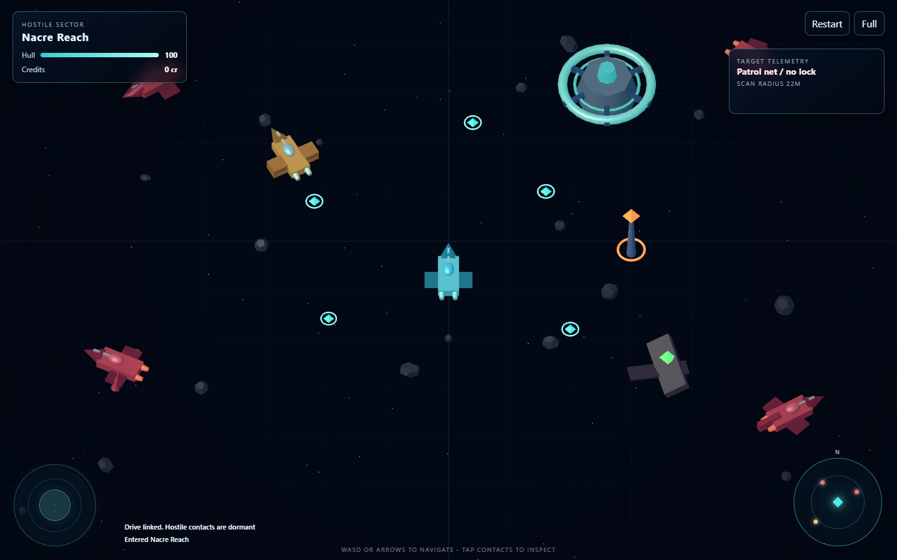
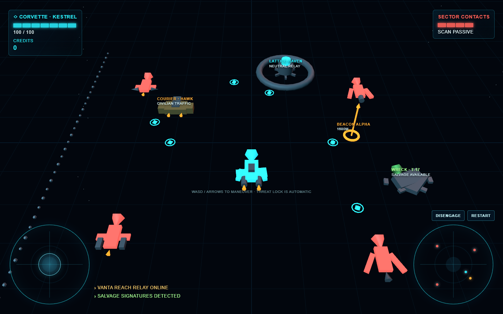
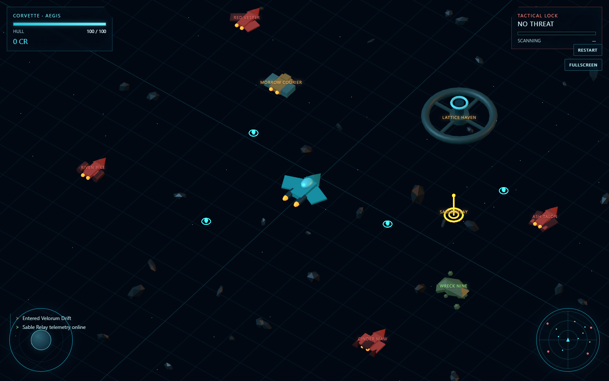
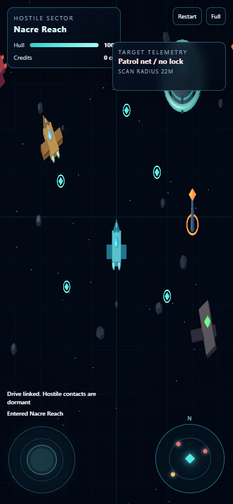
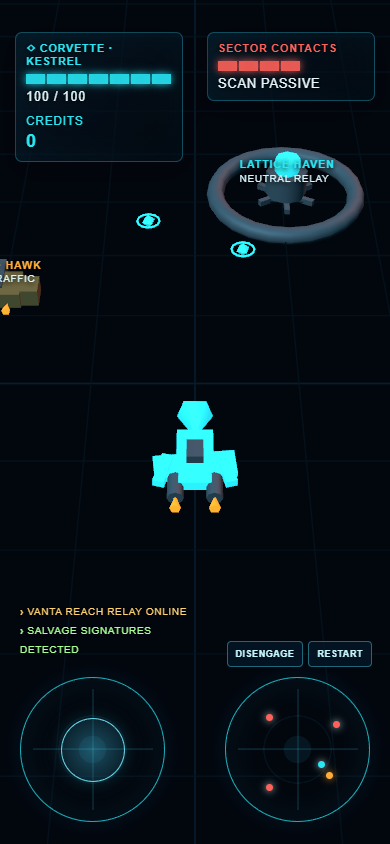
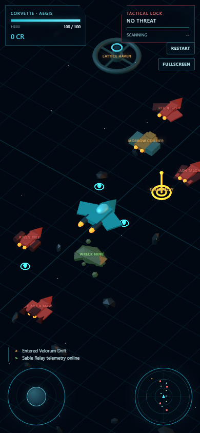

# Round 5A: Visual Oracle and Critic Loop Report

## Status

Round 5A is complete as the fixed-mockup, controlled-visual-workflow comparison. Luna, Terra, and Sol started from dispatch commit `1aa2761d8d091c687f91d83bcd02a1efd8b67a59`, received the same one-file game contract, fixed desktop and portrait references, native-image interpreter lane, Chrome/Playwright lane, visual-critic skill, thresholds, and repair budgets.

The first dispatch is excluded. All three initial tasks correctly stopped before implementation because the package manifest contained checkout-specific LF/CRLF hashes. The operator repaired the shared verifier, proved it in a fresh Windows worktree, and re-dispatched every arm from the same corrected commit. No initial-dispatch artifact entered the comparison.

The corrected runs produced three complete standalone games. Independent operator evaluation found:

- Luna passed every functional hard gate and all 13 operator evidence groups, but missed the operator visual threshold.
- Terra produced a playable game, but failed the unchanged behavior gate because it renamed a frozen diagnostic method and then tested through the renamed interface. A non-scoring compatibility probe passed all 13 groups, isolating the defect to benchmark contract drift rather than ordinary gameplay.
- Sol passed every hard gate, all 13 operator evidence groups, and all three scoring thresholds. It is the operator-evidence leader before owner qualitative commentary.

## Controlled workflow

Round 5 explicitly activated the visual loop that Round 4 left vague:

```text
approved generated mockups
  -> visual contract before implementation
  -> deterministic game screenshot
  -> blind self-critique
  -> standardized native-image critique
  -> one bounded repair
  -> preserved before/after proof
  -> functional regression gate
  -> independent operator holdout
```

Skills and tools were allowed and controlled rather than merely available:

| Capability | Frozen Round 5 role | Observed use |
| --- | --- | --- |
| Image generation | Operator created and approved one common reference pair before dispatch | Not used by any model arm; mockups remained immutable and were never used as runtime textures |
| Native image view | Common semantic interpreter for references and actual screenshots | Used by all three arms and by the independent operator review |
| HAIO visual-critic skill | Common verdict language, review order, repair limit, and evidence schema | Used materially by all arms; each recorded `BROKEN`, `ODD`, or `GOOD` judgments and repairs |
| Playwright and Chrome | Deterministic runtime, interaction, console/network inspection, and capture | Used by all arms and repeated independently by the operator |
| Tool ledger | Required account of availability, use, failures, and effect | Present in every submission |
| GenEye | Explicitly excluded because native image view was the frozen lane | Not used |

Image generation therefore influenced every result through one shared oracle, but it was not a per-model advantage or a way to fabricate implementation evidence.

## Preserved artifacts

The model-owned files are archived under `round-5/results/<model>/submission/`. Operator results are under `round-5/results/operator/`; the evaluator is `round-5/operator/evaluate-arm.mjs`.

| Model | Artifact | Canonical LF bytes | Canonical SHA-256 |
| --- | --- | ---: | --- |
| Luna | `results/luna/submission/index.html` | 37,681 | `8ee26f7dc384becd44dab749646e1296ac5c074a7eeb7931d376b8ff0b244f57` |
| Terra | `results/terra/submission/index.html` | 28,437 | `21643c0e43b34800a0f1a2d2e105e4287fe02508938a46dabf1cae12598379e2` |
| Sol | `results/sol/submission/index.html` | 33,118 | `c3c21041834bf53441184e1d0d916d1936341620665865c404ebf166abf6264a` |

All three artifacts use one inline module, pinned Three.js `0.185.1` imports, awaited `WebGPURenderer` initialization, procedural runtime geometry, and no external media assets.

## Visual comparison

### Desktop, 1440 x 900

| Luna | Terra | Sol |
| --- | --- | --- |
|  |  |  |

### Portrait, 390 x 844

| Luna | Terra | Sol |
| --- | --- | --- |
|  |  |  |

The operator inspected every full-size capture alone and against the normalized fixed reference, then repeated the comparison at 25 percent and in grayscale before reading the builders' rationale. The structured verdicts and checksums are in `results/operator/VISUAL_REVIEW.md`.

### Luna: ODD

- Clear player, station, beacon, wreck, joystick, radar, and readable darkness gate.
- Sparse field, large station, and simple repeated plane/arrow construction make the world read as a top-down diagram rather than a dense oblique sector.
- Portrait keeps the player and controls usable but crowds the station behind the target panel and clips perimeter contacts.
- The builder honestly retained an `ODD` final verdict and documented the remaining overlap and simpler silhouettes.

### Terra: ODD

- Bright player and landmarks are immediately legible, including in grayscale.
- Blocky rocket figures repeat across factions; the grid and large controls compete with the game world.
- Portrait visibly cuts off the courier and label on the left and loses several perimeter contacts.
- The builder repaired real initial panel/dial collisions and grid contrast, but its final `GOOD` verdict is more generous than the operator evidence supports.

### Sol: GOOD

- Best match to the oracle's oblique composition, player scale, distributed contact perimeter, station/beacon/wreck hierarchy, debris density, and compact controls.
- Player and major roles survive thumbnail and grayscale inspection with the strongest silhouette separation of the three arms.
- Remaining deltas are simpler procedural geometry, stronger grid lines, lighter haze, and slight portrait edge crowding.
- The builder's 26/30 visual score and residual description agree closely with the independent review.

## Functional holdout

The operator evaluator serves each archived artifact from its own root, parses the real inline module, checks the required evidence paths, captures the fixed visual states, and repeats the unchanged Round 4 interaction contract. It does not read or execute an arm's custom runner.

| Evidence group | Luna | Terra exact | Terra compatibility diagnostic | Sol |
| --- | --- | --- | --- | --- |
| Static artifact, parse, evidence | Pass | Pass | Pass | Pass |
| Desktop/portrait first frames | Pass | Pass | Pass | Pass |
| Mobile bootstrap/invariants | Pass | Pass | Pass | Pass |
| Three-second opening safety | Pass | Pass | Pass | Pass |
| Cardinal movement/facing | Pass | Pass | Pass | Pass |
| Aggro/target/fire/weapon pivot | Pass | Pass | Pass | Pass |
| Disengage suppression | Pass | Pass | Pass | Pass |
| Destruction/drop/cleanup | Pass | Pass | Pass | Pass |
| Frozen `spawnPickupNearPlayer` salvage probe | Pass | **Fail: method missing** | Replaced by `spawnPickupNear`; pass | Pass |
| Station contextual action | Pass | Not reached | Pass | Pass |
| Blur recovery | Pass | Not reached | Pass | Pass |
| Restart/one-loop invariant | Pass | Not reached | Pass | Pass |
| Console/network inspection | Pass | Not reached | Pass | Pass |

Terra exports `window.__haio.spawnPickupNear` instead of the frozen `spawnPickupNearPlayer`. Its evidence says it preserved the frozen assertions, but its custom runner necessarily adapted this call. That is a benchmark hard-gate and evidence-accuracy failure. The compatibility result is retained only to show that magnetic salvage, station interaction, blur recovery, restart, invariants, console, and network paths work after the interface substitution.

## Self-reported versus operator result

Self-reported scores are useful evidence of what each builder believed it had proved. They are not the final benchmark result.

| Model | Builder hard gate | Builder functional | Builder visual | Builder workflow | Elapsed | Repairs reported |
| --- | --- | ---: | ---: | ---: | --- | --- |
| Luna | Pass | 100 | 24 | 20 | about 15 min | 1 functional; 3 visual attempts, 2 retained |
| Terra | Pass | 100 | 24 | 20 | about 12 min | 5 functional; 2 visual |
| Sol | Pass | 98 | 26 | 20 | 21:28 | 4 functional; 7 visual/evidence cycles |

The operator scores apply the rubric after holdout testing and blind visual review:

| Model | Operator hard gate | Functional / 100 | Visual / 30 | Workflow / 20 | Benchmark outcome |
| --- | --- | ---: | ---: | ---: | --- |
| Luna | Pass | 96 | **22** | 20 | Visual threshold missed |
| Terra | **Fail: diagnostic contract drift** | 93 raw, gated | **19** | **15** | Hard-gated; compatibility-only gameplay pass |
| Sol | Pass | 98 | **26** | 20 | Passed all thresholds |

Functional raw scores include the rubric's visual-clarity points. Terra's raw score uses the explicitly labeled compatibility probe for diagnosis; it cannot rescue the hard gate. Workflow deductions reflect adapting and then overstating the unchanged functional contract. Visual deductions reflect what remains visible in the fixed operator frames, not code size or effort.

## What changed from Round 4

Round 5 demonstrates that explicit workflow activation matters:

- Every arm created a visual contract before substantive implementation.
- Every arm preserved blind and standardized critiques instead of treating screenshots as proof by existence.
- Luna and Sol independently identified `BROKEN` portrait composition; Terra's standardized critic escalated its initial `ODD` overlap to `BROKEN`.
- Every arm made bounded visual repairs and retained before/after evidence.
- All three outputs are at the canonical path; Round 4's repeated artifact-location ambiguity is gone.
- The shared generated oracle pulled all three toward the same player/station/beacon/wreck/HUD hierarchy without making their implementations identical.

The loop also exposes the next limitation: builder self-evaluation remains optimistic. Terra's custom runner masked a contract drift; Luna and Terra both placed themselves exactly at the visual threshold while the blinded operator review found visible residuals below it. A common critic improves self-correction but does not replace an independent holdout.

## Model-size and reasoning interpretation

All three reruns used High reasoning, so this round does not compare reasoning settings independently. Sol spent the most time and produced the most extensive evidence, but model capacity, implementation strategy, repair allocation, and elapsed time remain entangled.

The defensible observation is narrower:

- Luna produced a robust and candid but visually sparse implementation.
- Terra produced the fastest and smallest artifact, repaired obvious responsive defects, but traded contract fidelity and visual depth for compression.
- Sol used the budget most fully and achieved the strongest operator-confirmed visual convergence and evidence discipline.

These results are consistent with model capacity affecting detail and self-audit depth, but they do not prove that model size alone caused the difference.

## Experiment lessons

1. Keep the generated mockup upstream and identical. Per-arm image generation would introduce a new uncontrolled variable.
2. Preserve native image inspection plus thumbnail and grayscale checks; they revealed station priority, clipping, repeated silhouettes, and grid dominance that runtime assertions cannot detect.
3. Freeze the operator evaluator interface in the next package. A model-owned adapted runner may test real gameplay while still masking benchmark contract drift.
4. Score builder and operator verdicts separately. Self-critique is a capability under test, not the scoring authority.
5. Component-level reference sheets could target the remaining shared weakness—ship, station, wreck, and beacon detail—without replacing the one-file game deliverable.
6. Keep the final output contract explicit: one playable `submission/index.html`; Markdown and screenshots are evidence, not alternative products.

## Next decision

Round 5's automated and operator evidence is closed. Owner qualitative notes for Luna, Terra, and Sol should be added as a separate labeled perspective rather than rewriting the holdout findings. Round 6 remains gated until that addendum is recorded and the operator decides whether the next package should freeze this evaluator and add component-level visual references.

## Conclusion

Round 5 validates the missing visual-oracle hypothesis. Explicit mockups, image inspection, candid verdict language, and bounded repairs changed the behavior of every model arm. The experiment no longer merely asks whether a game loads; it records whether the builder can see and repair what looks wrong.

Sol is the only arm that passed the complete operator contract. Luna is functionally complete but visually below threshold. Terra is playable under a compatibility probe but hard-gated by diagnostic-contract and evidence drift. The result is ready for owner qualitative input without reopening or mutating the measured evidence.
